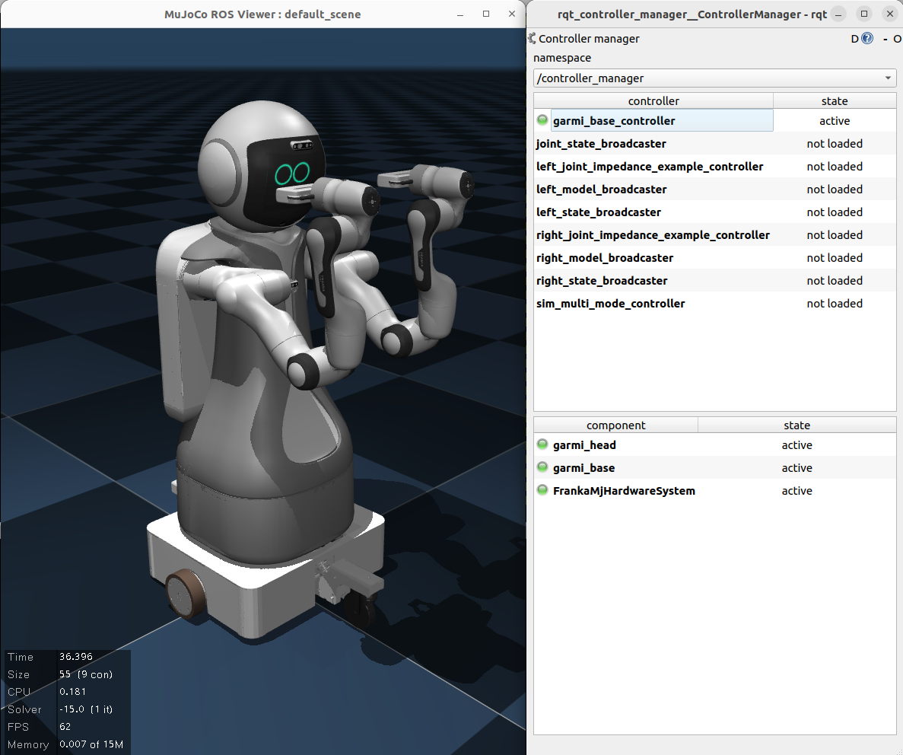

# multipanda_ros2
## A sim- and real Panda robot integration based on the `ros2_control` framework




This project implements most features from the original `franka_ros` repository in ROS2 Humble, specifically for the Franka Emika Robot (Panda).
This project significantly expands upon the original `franka_ros2` from the company, who dropped the support for the Pandas.

Additionally, multi-arm mujoco simulation has been integrated, meaning you can now run the same controller on both simulated and real robots. 
The simulation is designed as a plugin to the [`mujoco_ros_pkg`](https://github.com/ubi-agni/mujoco_ros_pkgs/). 

**The current version relies on a [fork of the repository](https://github.com/tenfoldpaper/mujoco_ros_pkgs)**, which implements the `ros2_control` plugin as well as a generic `SystemInterface` for simple robot setups (e.g. a Panda arm mounted on a mobile base). This means, you should install the fork, not the original repo, until the two have been merged.

Work is ongoing to integrate FR3 into the architecture.

## Documentation

Documentation for this project is available [here](./docs/main.md).

## Working features
More thorough information is available in the documentation.

* Real robot:
    * FrankaState broadcaster
    * All control interfaces (torque, position, velocity, Cartesian).
    * Example controllers for all interfaces
    * Controllers are swappable using rqt_controller_manager
    * Runtime franka::ControlException error recovery via `~/service_server/error_recovery`
        * Upon recovery, the previously executed control loop will be executed again, so no reloading necessary.
    * Runtime internal parameter setter services much like what is offered in the updated `franka_ros2`
* Sim robot:
    * Same as the real robot, except Cartesian command interface is not available, and there is no plan to implement this for now.
    * Gripper server with identical interface to the real gripper (i.e. action servers)
    * Example controllers for the real single-arm listed above, that correspond to those interfaces, work out of the box.
    * FrankaState implements the basics: torque, joint position/velocity, `O_T_EE` and `O_F_ext_hat`.
    * Model provides all the existing functions: `pose`, `zeroJacobian`, `bodyJacobian`, `mass`, `gravity`, `coriolis`.
        * Gravity for now just returns the corresponding `qfrc_gravcomp` force from mujoco.
        * Coriolis = `qfrc_bias - qfrc_gravcomp`
    * Camera is available as part of `mujoco_ros_pkg`'s features. You can simply add a `<camera>` object in your mujoco XML file, and the package will handle them.
    * With the forked repository's `mujoco_ros2_control_system` package, you can easily add components with additional degrees of freedom to your robot. Take a look at `garmi_packages/garmi_description/robots/*.ros2_control.xacro` for an example on how to do this.

## Known issues
* Joint position controller might cause some bad motor behaviors. Suggest using torque or velocity for now.
* The default `franka_moveit_config` package depends on `warehouse_ros_mongo`, which has been deprecated. It has been changed to `warehouse_ros_sqlite` for now to ensure that `rosdep install` works properly. For now, please refer to this discussion [here](https://discourse.ros.org/t/fixing-moveit2-humble-moveit-ros-benchmarks-package/32048) for a potential solution; once a proper solution has been identified, it will be added.

## Installation guide
(Tested on Ubuntu 22.04, ROS2 Humble, Panda 4.2.2 & 4.2.1, `libfranka` 0.9.2 and MuJoCo 3.2.0)
On a computer running Ubuntu 22.04 and real-time kernel (if you wish to use it with a real robot), do the following:
1. Install ROS2 Humble by following their [instructions][humble-instructions] and create a workspace.
5. Install library dependencies:
    - Install [Eigen **3.3.9**](https://gitlab.com/libeigen/eigen/-/releases/3.3.9). Remove Eigen 3.4.0 if that was installed from following the `libfranka` steps.
        - Some functions will break if you use Eigen 3.4.0, and will fail to compile.
    - Install [`dq-robotics`](https://dqrobotics.github.io/) C++ version
2. Build `libfranka` 0.9.2 from source: 
    - Install dependencies: `sudo apt-get install -y build-essential cmake git libpoco-dev  libfmt-dev`
        - (Ideally, you should already have `build-essential`, `cmake` and `git`already installed)
    - Clone the `libfranka` repo: `git clone https://github.com/frankaemika/libfranka.git`
    && mkdir /home/user/Libraries/libfranka \
    && cd libfranka \
    - Check out 0.9.2 and update the submodules:
        ``` bash
        cd libfranka
        git checkout 0.9.2 
        git submodule init 
        git submodule update 
        ```
    - Build the library, and install it to the directory of your choice (here, `~/Libraries/libfranka`)
        ``` bash
        mkdir build && cd build
        cmake -DCMAKE_BUILD_TYPE=Release -DBUILD_TESTS=OFF -DCMAKE_INSTALL_PREFIX=/home/user/Libraries/libfranka ..
        cmake --build .
        cmake --install .
        ```

3. Build MuJoCo **3.2.0** (required by `mujoco_ros_pkg`) from source by following the [instructions][mujoco-instructions].
4. Install `mujoco_ros_pkg`, specifically [this fork](https://github.com/tenfoldpaper/mujoco_ros_pkgs).
6. Clone this repository (i.e. the multipanda) into your workspace's `src` folder.
7. Install the dependencies by running this rosdep command from the workspace root: 
    
    `rosdep install --from-paths src -y --ignore-src`
7. Export the `{mujoco/libfranka}/lib/cmake` directories as a `CMAKE_PREFIX_PATH` in your environment, i.e.
    - in `~/.bashrc`, `export CMAKE_PREFIX_PATH={path to mujoco installation}/lib/cmake:{path to libfranka installation}/lib/cmake`
8. Add the build path to your `LD_LIBRARY_PATH` by adding the following line to your `~/.bashrc`: 
    
    `export LD_LIBRARY_PATH=$LD_LIBRARY_PATH:{path to libfranka install}/lib:{path to mujoco's install}/lib`
9. Source the workspace, then in your workspace root, call: 
    
    `colcon build --cmake-args -DCMAKE_BUILD_TYPE=Release`
    - The paths to mujoco and libfranka are added to `CMAKE_PREFIX_PATH`, so no separate args are needed.
    - The MuJoCo path is the INSTALLED folder's directory. The `lib` folder should only have the two `.so` files, and a folder called `cmake`.
    - Likewise, the `libfranka` path should contain the `cmake` folder and the `.so` files.
10. To run:
    - Single arm:
        1. with real robot, source the workspace, and run:
            - Default: `ros2 launch franka_bringup franka.launch.py robot_ip:=<fci-ip>`.
            - Multi-mode: `ros2 launch franka_bringup multimode_franka.launch.py robot_ip:=<fci-ip>`.
            - `arm_id` is fixed to `panda`.
        2. for simulated robot, source the workspace, and run:
            - Default: `ros2 launch franka_bringup franka_sim.launch.py`.
            - `arm_id` is fixed to `panda`.
            - Currently, only the robot with gripper attachment is available.
    - Dual arm:
        1. with real robot, source the workspace, and run:
            - Default: `ros2 launch franka_bringup dual_franka.launch.py robot_ip_1:=<robot-1-fci-ip> robot_ip_2:=<robot-2-fci-ip> arm_id_1=<robot-1-name> arm_id_2=<robot-2-name>`.
            - Multi-mode: `ros2 launch franka_bringup dual_multimode_franka.launch.py robot_ip_1:=<robot-1-fci-ip> robot_ip_2:=<robot-2-fci-ip> arm_id_1=<robot-1-name> arm_id_2=<robot-2-name>`.
            - There is no default `arm_id`.
            - Grippers are set to true by default; add `hand_n=false` to disable this.
        2. for simulated robot, source the workspace, and run:
            - Default: `ros2 launch franka_bringup dual_franka_sim.launch.py`.
            - `arm_id_1=mj_left` and `arm_id_2=mj_right` by default.
    - Garmi (mobile manipulator with two Panda arms):
        1. for simulated robot, source the workspace, and run:
            - `ros2 launch garmi_bringup sim_garmi.launch.py`

## Using with Docker
1. Build the docker image:
    1. at the root of the repository (where `Dockerfile` is located), run 
        `sudo docker build -t "bimanual:garmi" ./`, or whatever name you want; just adjust them in the `docker-compose.yml` or the `docker run` command below.
    2. This installs all the required packages including `rosdep`.
2. Start the docker container with `docker compose` (for iGPUs):
    *   `xhost +; sudo docker compose -f docker-compose.yml up`
        * `xhost +` is needed to give the Docker container access to the host's screen.
        * The `docker-compose.yml` file defines configurations that allow the container to run on the realtime kernel of the host, assuming that the host has one. The instructions were found in [here](https://github.com/2b-t/docker-realtime?tab=readme-ov-file).
        * Currently, running GUI apps outputs warnings in the console. Those can be ignored.
    *   Alternatively, with `docker run` (this has no RT kernel, so only the sim would work)
        ``` bash
        xhost +
        sudo docker run \
        -dit \
        -v /tmp/.X11-unix:/tmp/.X11-unix \
        --device=/dev/dri:/dev/dri \
        --env="DISPLAY=$DISPLAY" \
        --name=my_container \
        --network="host" \
        bimanual:garmi
        ```
        * The `--network="host"` is what enables the FCI IP address to be found from inside Docker without any additional configuration. TODO: Add a more elegant way to handle this.
    * For other GPUs, please refer online.
3. Access the container with:
    - for `compose`, `sudo docker exec -it realtime_humble bash`
    - for `run`, `sudo docker exec -it my_container bash`
4. (OPTIONAL) Check that the connection to the robot, RT kernel and screen are all working fine. 
    - You can check if docker is properly linked to your screen by running:
        - `ros2 run rviz2 rviz2` or
        - `~/Libraries/mujoco/bin/simulate`
    - For RT kernel and robot connection, run
        - `~/Libraries/libfranka/bin/communication_test <robot-ip>`

            
## Credits
The original version is forked from mcbed's port of franka_ros2 for [humble][mcbed-humble].

## License

All packages of `multipanda_ros2` are licensed under the [Apache 2.0 license][apache-2.0], following `franka_ros2`.

[apache-2.0]: https://www.apache.org/licenses/LICENSE-2.0.html
[fci-docs]: https://frankaemika.github.io/docs
[mcbed-humble]: https://github.com/mcbed/franka_ros2/tree/humble
[libfranka-instructions]: https://frankaemika.github.io/docs/installation_linux.html
[mujoco-instructions]: https://mujoco.readthedocs.io/en/latest/programming/#building-mujoco-from-source
[humble-instructions]: https://docs.ros.org/en/humble/Installation.html
