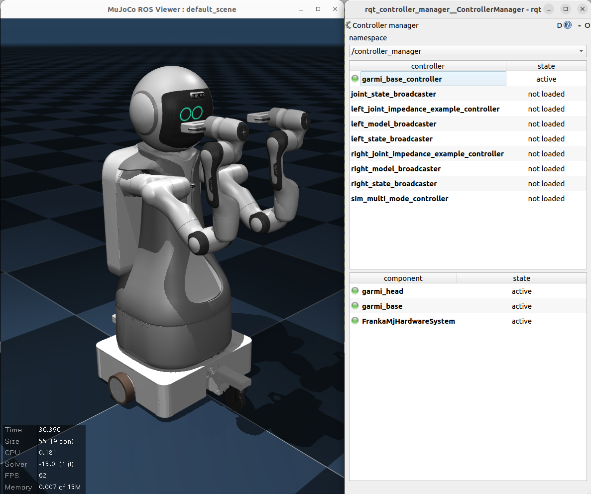

# garmi_packages



This collection of packages is an example of how you can create an extension of the Panda in the MuJoCo simulation, e.g. by integrating components with additional degrees-of-freedom (DOF).

GARMI is our group's mobile manipulator platform. It is comprised of a 2-DOF head (pan and tilt), and a 2-DOF non-holonomic base. The head is torque-controlled, while the base is velocity-controlled.

## garmi_bringup
The bringup package is more or less identical to the `franka_bringup` package. It is simply created to keep the codebase cleaner.

## garmi_controllers
This package contains two simple controllers, one each for the head and the base. The `head_controller` implements a basic PD torque position controller to control the head position. It takes a `Float64MultiArray` as an argument, with `data[0]` specifying the pan and `data[1]` specifying the tilt.

The `mobile_base_controller` implements a basic velocity controller with non-holonomic considerations. It takes in a `Twist` message, which is then converted into individual wheel velocities based on the mobile base kinematic parameters. Only `position.x` and `rotation.z` components are taken into account.

This package can be used as a starting point for creating your own `controllers` package separate from the `franka_example_controllers`.

## garmi_description
This package contains the MuJoCo XML files describing GARMI, and the corresponding xacro files. 

The main xacro file, `garmi_sim.urdf.xacro` makes direct references to `franka_description`'s `panda_arm.xacro` and `hand.xacro` files; this is how you cna avoid having to make copies of the Panda description files. 

The MuJoCo XML file is self-contained, as GARMI's model was built up separately from the original Panda MuJoCo XML. Though, it could be configured to look for common elements such as the mesh `.dae` files from `franka_description`. Nonetheless, given MuJoCo's relative inflexibility compared to `xacro` in performing functions and variable references, this might be more trouble than it is worth.

`garmi_base_mjros.ros2_control.xacro` and `garmi_head_mjros.ros2_control.xacro` show how you can use the default `mujoco_ros2_control_system/MujocoRos2System` to easily create `ros2_control` interfaces for simple actuated components. No dedicated `SystemInterface` needs to be written in such cases, when all you are interested in are joint-level sensor data and actuator commands.

By referring to this package, you can easily create your own custom Panda configurations comprised of additional DOF components, like a more sophisticated gripper or mobile bases.

When creating your own robot `description` package, don't forget to add this part to the `CMakeLists.txt` to make sure that your files are installed correctly:
``` makefile
# Install launch files.
install(DIRECTORY
  robots mujoco # folders containing the xacro and mujoco's xml, respectively
  DESTINATION share/${PROJECT_NAME}/
)
```

## Other chapters
- [Back to main](../main.md)
- [franka_bringup](./franka_bringup.md)
- [franka_description](./franka_description.md)
- [franka_hardware](./franka_hardware.md)
- [franka_multi_mode_controller](./franka_multi_mode_controller.md)
- [garmi_packages](./garmi.md)